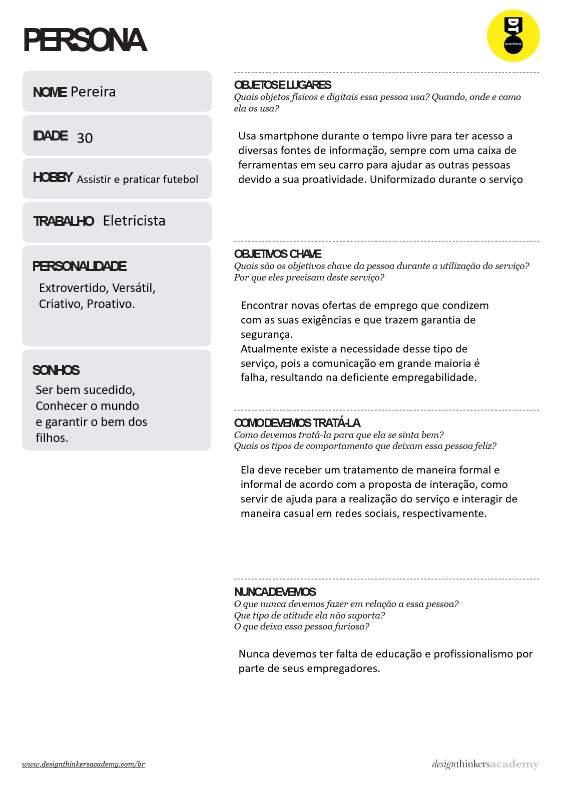
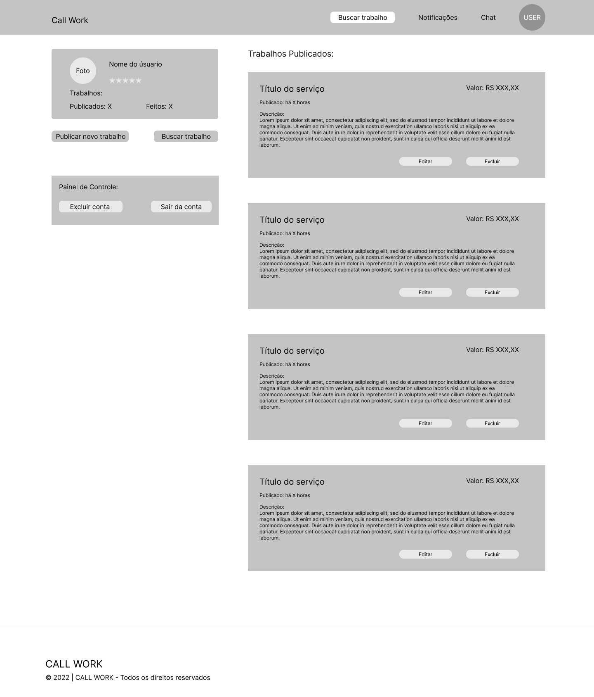

# Informações do Projeto
`TÍTULO DO PROJETO`  

Guia de Serviços - CALL WORK

`CURSO` 

Sistemas de Informação - PUC Minas

## Participantes

* Arthur Henrique da Silva Proença
* Gustavo Henrique de Moura Luz
* Ítalo Braga
* Matheus Henrique de Souza Oliveira
* Pâmella Almeida
* Vinicius Liberio Gomes de Lacerda

# Estrutura do Documento

- [Informações do Projeto](#informações-do-projeto)
  - [Participantes](#participantes)
- [Estrutura do Documento](#estrutura-do-documento)
- [Introdução](#introdução)
  - [Problema](#problema)
  - [Objetivos](#objetivos)
  - [Justificativa](#justificativa)
  - [Público-Alvo](#público-alvo)
- [Especificações do Projeto](#especificações-do-projeto)
  - [Personas e Mapas de Empatia](#personas-e-mapas-de-empatia)
  - [Histórias de Usuários](#histórias-de-usuários)
  - [Requisitos](#requisitos)
    - [Requisitos Funcionais](#requisitos-funcionais)
    - [Requisitos não Funcionais](#requisitos-não-funcionais)
  - [Restrições](#restrições)
- [Projeto de Interface](#projeto-de-interface)
  - [User Flow](#user-flow)
  - [Wireframes](#wireframes)
- [Metodologia](#metodologia)
  - [Divisão de Papéis](#divisão-de-papéis)
  - [Ferramentas](#ferramentas)
  - [Controle de Versão](#controle-de-versão)
- [**############## SPRINT 1 ACABA AQUI #############**](#-sprint-1-acaba-aqui-)
- [Projeto da Solução](#projeto-da-solução)
  - [Tecnologias Utilizadas](#tecnologias-utilizadas)
  - [Arquitetura da solução](#arquitetura-da-solução)
- [Avaliação da Aplicação](#avaliação-da-aplicação)
  - [Plano de Testes](#plano-de-testes)
  - [Ferramentas de Testes (Opcional)](#ferramentas-de-testes-opcional)
  - [Registros de Testes](#registros-de-testes)
- [Referências](#referências)

# Introdução

## Problema

Desde sempre, muitas pessoas necessitaram de outras para a realização de tarefas que não conseguiram concluir, muitas vezes por falta de tempo ou conhecimento. Com o passar do tempo as formas comuns de freelancers procurarem emprego estão se tornando obsoletas e as pessoas passaram a ter dificuldades em encontra-los.

## Objetivos

......  COLOQUE AQUI O SEU TEXTO ......

> Aqui você deve descrever os objetivos do trabalho indicando que o
> objetivo geral é desenvolver um software para solucionar o problema
> apresentado acima. Apresente também alguns (pelo menos 2) objetivos
> específicos dependendo de onde você vai querer concentrar a sua
> prática investigativa, ou como você vai aprofundar no seu trabalho.
> 
> **Links Úteis**:
> - [Objetivo geral e objetivo específico: como fazer e quais verbos utilizar](https://blog.mettzer.com/diferenca-entre-objetivo-geral-e-objetivo-especifico/)

## Justificativa

Com as dificuldades em encontrar um bom profissional ou até um bom serviço, nasceu o projeto CALL WORK que tem uma proposta de facilitar e conciliar
o contato entre o contratante e o profissional, funcionando como um
guia de serviços, no qual o site serve para encontrar e divulgar trabalhos.

## Público-Alvo

Inicialmente, as vagas, além dos contratantes, serão focadas para servidores autônomos de baixa
especialização, disponibilizando tarefas como: eletricista, diarista, encanador,
jardineiro, babá, entre outros. Com o intuito facilitar e conciliar
o contato entre o contratante e o profissional

 
# Especificações do Projeto

......  COLOQUE AQUI O SEU TEXTO ......

> Apresente uma visão geral do que será abordado nesta parte do
> documento, enumerando as técnicas e/ou ferramentas utilizadas para
> realizar a especificações do projeto

## Personas e Mapas de Empatia

De acordo com as entrevistas qualitativas, pôde-se gerar mapas de empatia que auxiliaram na criação da persona
de uma pessoa profissional que pode resolver qualquer problema que possa vier acontecer em suas atividades diárias.

## Histórias de Usuários

Com base na análise das personas foram identificadas as seguintes histórias de usuários:

|EU COMO... `PERSONA`| QUERO/PRECISO ... `FUNCIONALIDADE` |PARA ... `MOTIVO/VALOR`                 |
|--------------------|------------------------------------|----------------------------------------|
|Eu como pintor      | Gostaria de uma plataforma que me  | Para que eu consiga mais               |
|                    | ajudasse a encontrar mais          | oportunidades de trabalho              |
|                    | oportunidades.                     |                                        |
|--------------------|------------------------------------|----------------------------------------|
| Eu como Dona       | Gostaria de sites que me           | Para realizar tarefas pequenos         |
| de casa            | orientassem melhor                 | consertos domésticos.                  |
|                    | sobre onde encontrar bons          |                                        |
|                    | profissionais.                     |                                        |
|--------------------|------------------------------------|----------------------------------------|
|Eu como encanador   | Gostaria de ferramentas online     | Para que eu tivesse mais segurança.    |
|                    | que me auxiliassem com as          |                                        |
|                    | transações financeiras.            |                                        |
|--------------------|------------------------------------|----------------------------------------|
| Eu como            | Gostaria de poder contratar        | Para realizar algumas tarefas em casa  |
| trabalhador em     | pessoas de confiança e com         | e ter mais segurança para trabalhar.   |
| home office        | bons históricos para realizar      |                                        |
|--------------------|------------------------------------|----------------------------------------|

## Requisitos

As tabelas que se seguem apresentam os requisitos funcionais e não funcionais que detalham o escopo do projeto.

### Requisitos Funcionais

|ID    | Descrição do Requisito                     | Prioridade |
|------|-------------------------------------------------|-------|
|RF-001| Permitir que o usuário cadastre tarefas         | ALTA  | 
|RF-002| Realizar pagamentos                             | MÉDIA |
|RF-003| Agendar serviços                                | ALTA  |
|RF-004| Cancelar serviços                               | ALTA  |
|RF-005| Emitir histórico e avaliações de solicitantes   | BAIXA |
|RF-006| Realizar cadastro de solicitante                | ALTA  |
|RF-007| Recuperar senha de login                        | MÉDIA |
|RF-008| Realizar cadastro de colaborador                | ALTA  |
|RF-009| Emitir lista de EPI e instruções ao colaborador | BAIXA |
|RF-010| Iniciar e finalizar serviços                    | BAIXA |
|RF-011| Localizar colaboradores                         | MÉDIA |
|RF-012| Localizar solicitantes                          | MÉDIA |
|RF-013| Suporte ao usuário                              | ALTA  |
|------|-------------------------------------------------|-------|

### Requisitos não Funcionais

|ID     | Descrição do Requisito                                                      |Prioridade |
|-------|--------------------------------------------------------------------------------|--------|
|RNF-001| O sistema deve ser responsivo para rodar em um dispositivos móvel              |  MÉDIA | 
|RNF-002| Deve processar requisições do usuário em no máximo 3s                          |  ALTA  |
|RNF-003| Cadastramento simplificado                                                     |  BAIXA |
|RNF-004| Usabilidade simplificada                                                       |  MÉDIA |
|RNF-005| Transitar dados de forma segura                                                |  ALTA  |
|RNF-006| Avaliações de usuários simplificada (através uma disposição de cinco estrelas) |  BAIXA |
|RNF-007| Design e layout intuitivo                                                      |  BAIXA |
|RNF-008| Contratação de apenas um colaborador por serviço                               |  MÉDIA |
|RNF-009| Os navegadores suportados serão: Chrome, Firefox, Safari e Microsoft Edge      |  BAIXA |
|-------|--------------------------------------------------------------------------------|--------|

## Restrições

O projeto está restrito pelos itens apresentados na tabela a seguir.

|ID| Restrição                                                      |
|--|----------------------------------------------------------------|
|01| O projeto deverá ser entregue até o final do semestre          |
|02| Guia de serviços relacionados somente com atividade doméstica  |
|03| Somente atividades que não exigem alto nível de especialização |
|04| Será permitida a associação de apenas 1 colaborador por serviço|
|05| A interface do sistema deve ser web                            |
|--|----------------------------------------------------------------|

# Projeto de Interface

Aqui se inicia o conceito do desenvolvimento do sistema web, usando como base o 
fluxo de usúario, wireframes e o protótipo interativo. Todas as páginas foram
criadas pensando em nos requisitos necessários.

## User Flow

## Wireframes

# Metodologia

......  COLOQUE AQUI O SEU TEXTO ......

> Nesta parte do documento, você deve apresentar a metodologia 
> adotada pelo grupo, descrevendo o processo de trabalho baseado nas metodologias ágeis, 
> a divisão de papéis e tarefas, as ferramentas empregadas e como foi realizada a
> gestão de configuração do projeto via GitHub.
>
> Coloque detalhes sobre o processo de Design Thinking e a implementação do Framework Scrum seguido
> pelo grupo. O grupo poderá fazer uso de ferramentas on-line para acompanhar
> o andamento do projeto, a execução das tarefas e o status de desenvolvimento
> da solução.
> 
> **Links Úteis**:
> - [Tutorial Trello](https://trello.com/b/8AygzjUA/tutorial-trello)
> - [Gestão ágil de projetos com o Trello](https://www.youtube.com/watch?v=1o9BOMAKBRE)
> - [Gerência de projetos - Trello com Scrum](https://www.youtube.com/watch?v=DHLA8X_ujwo)
> - [Tutorial Slack](https://slack.com/intl/en-br/)

## Divisão de Papéis

Contexto do projeto (Arthur, Ítalo)
  Estudo dos atuais e futuros impactos que o produto gera no ramo ao qual
  pertence, assim como seu desempenho.

Especificação do Projeto (Pâmella, Matheus e Gustavo)
  Coleta de dados baseada nas necessidades dos usuários e definição de
  requisições do projeto.

Projeto de Interface (Vinicius)
  Escopo da interface, sendo referência do que será desenvolvido durante
  o projeto.

Metodologia (Em grupo)
  Descrição das etapas de desenvolvimento do projeto.

Slide (Ítalo, Arthur)
  Material de apoio para apresentação do contexto geral do projeto.

Artefatos do Design Thinking (Em grupo)
  Organização de ideias afim de auxiliar na tomada de decisões.
  

## Ferramentas

......  COLOQUE AQUI O SEU TEXTO - SIGA O EXEMPLO DA TABELA ABAIXO  ......

| Ambiente  | Plataforma              |Link de Acesso |
|-----------|-------------------------|---------------|
|Processo de Design Thinkgin  | Miro |  https://miro.com/XXXXXXX | 
|Repositório de código | GitHub | https://github.com/XXXXXXX | 
|Hospedagem do site | Heroku |  https://XXXXXXX.herokuapp.com | 
|Protótipo Interativo | MavelApp ou Figma | https://figma.com/XXXXXXX | 

>
> Liste as ferramentas empregadas no desenvolvimento do
> projeto, justificando a escolha delas, sempre que possível.
> 
> As ferramentas empregadas no projeto são:
> 
> - Editor de código.
> - Ferramentas de comunicação
> - Ferramentas de diagramação
> - Plataforma de hospedagem
> 
> O editor de código foi escolhido porque ele possui uma integração com o
> sistema de versão. As ferramentas de comunicação utilizadas possuem
> integração semelhante e por isso foram selecionadas. Por fim, para criar
> diagramas utilizamos essa ferramenta por melhor captar as
> necessidades da nossa solução.
> 
> **Links Úteis - Hospedagem**:
> - [Getting Started with Heroku](https://devcenter.heroku.com/start)
> - [Crie seu Site com o HostGator](https://www.hostgator.com.br/como-publicar-seu-site)
> - [GoDady](https://br.godaddy.com/how-to)
> - [GitHub Pages](https://pages.github.com/)

## Controle de Versão

......  COLOQUE AQUI O SEU TEXTO ......

> Discuta como a configuração do projeto foi feita na ferramenta de
> versionamento escolhida. Exponha como a gerência de tags, merges,
> commits e branchs é realizada. Discuta como a gerência de issues foi
> realizada.
> A ferramenta de controle de versão adotada no projeto foi o
> [Git](https://git-scm.com/), sendo que o [Github](https://github.com)
> foi utilizado para hospedagem do repositório `upstream`.
> 
> O projeto segue a seguinte convenção para o nome de branchs:
> 
> - `master`: versão estável já testada do software
> - `unstable`: versão já testada do software, porém instável
> - `testing`: versão em testes do software
> - `dev`: versão de desenvolvimento do software
> 
> Quanto à gerência de issues, o projeto adota a seguinte convenção para
> etiquetas:
> 
> - `bugfix`: uma funcionalidade encontra-se com problemas
> - `enhancement`: uma funcionalidade precisa ser melhorada
> - `feature`: uma nova funcionalidade precisa ser introduzida
>
> **Links Úteis**:
> - [Tutorial GitHub](https://guides.github.com/activities/hello-world/)
> - [Git e Github](https://www.youtube.com/playlist?list=PLHz_AreHm4dm7ZULPAmadvNhH6vk9oNZA)
> - [5 Git Workflows & Branching Strategy to deliver better code](https://zepel.io/blog/5-git-workflows-to-improve-development/)
>
> **Exemplo - GitHub Feature Branch Workflow**:
>
> 

# **############## SPRINT 1 ACABA AQUI #############**

# Projeto da Solução

......  COLOQUE AQUI O SEU TEXTO ......

## Tecnologias Utilizadas

......  COLOQUE AQUI O SEU TEXTO ......

> Descreva aqui qual(is) tecnologias você vai usar para resolver o seu
> problema, ou seja, implementar a sua solução. Liste todas as
> tecnologias envolvidas, linguagens a serem utilizadas, serviços web,
> frameworks, bibliotecas, IDEs de desenvolvimento, e ferramentas.
> Apresente também uma figura explicando como as tecnologias estão
> relacionadas ou como uma interação do usuário com o sistema vai ser
> conduzida, por onde ela passa até retornar uma resposta ao usuário.
> 
> Inclua os diagramas de User Flow, esboços criados pelo grupo
> (stoyboards), além dos protótipos de telas (wireframes). Descreva cada
> item textualmente comentando e complementando o que está apresentado
> nas imagens.

## Arquitetura da solução

......  COLOQUE AQUI O SEU TEXTO E O DIAGRAMA DE ARQUITETURA .......

> Inclua um diagrama da solução e descreva os módulos e as tecnologias
> que fazem parte da solução. Discorra sobre o diagrama.
> 
> **Exemplo do diagrama de Arquitetura**:
> 
> 

# Avaliação da Aplicação

......  COLOQUE AQUI O SEU TEXTO ......

> Apresente os cenários de testes utilizados na realização dos testes da
> sua aplicação. Escolha cenários de testes que demonstrem os requisitos
> sendo satisfeitos.

## Plano de Testes

......  COLOQUE AQUI O SEU TEXTO ......

> Enumere quais cenários de testes foram selecionados para teste. Neste
> tópico o grupo deve detalhar quais funcionalidades avaliadas, o grupo
> de usuários que foi escolhido para participar do teste e as
> ferramentas utilizadas.
> 
> **Links Úteis**:
> - [IBM - Criação e Geração de Planos de Teste](https://www.ibm.com/developerworks/br/local/rational/criacao_geracao_planos_testes_software/index.html)
> - [Práticas e Técnicas de Testes Ágeis](http://assiste.serpro.gov.br/serproagil/Apresenta/slides.pdf)
> -  [Teste de Software: Conceitos e tipos de testes](https://blog.onedaytesting.com.br/teste-de-software/)

## Ferramentas de Testes (Opcional)

......  COLOQUE AQUI O SEU TEXTO ......

> Comente sobre as ferramentas de testes utilizadas.
> 
> **Links Úteis**:
> - [Ferramentas de Test para Java Script](https://geekflare.com/javascript-unit-testing/)
> - [UX Tools](https://uxdesign.cc/ux-user-research-and-user-testing-tools-2d339d379dc7)

## Registros de Testes

......  COLOQUE AQUI O SEU TEXTO ......

> Discorra sobre os resultados do teste. Ressaltando pontos fortes e
> fracos identificados na solução. Comente como o grupo pretende atacar
> esses pontos nas próximas iterações. Apresente as falhas detectadas e
> as melhorias geradas a partir dos resultados obtidos nos testes.

# Referências

......  COLOQUE AQUI O SEU TEXTO ......

> Inclua todas as referências (livros, artigos, sites, etc) utilizados
> no desenvolvimento do trabalho.
> 
> **Links Úteis**:
> - [Formato ABNT](https://www.normastecnicas.com/abnt/trabalhos-academicos/referencias/)
> - [Referências Bibliográficas da ABNT](https://comunidade.rockcontent.com/referencia-bibliografica-abnt/)