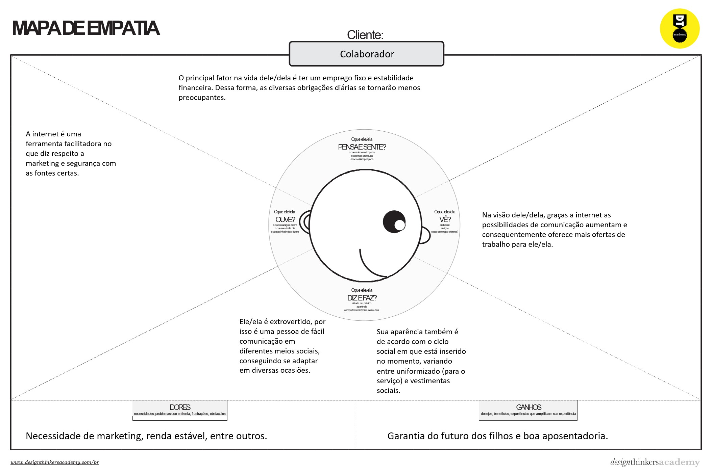
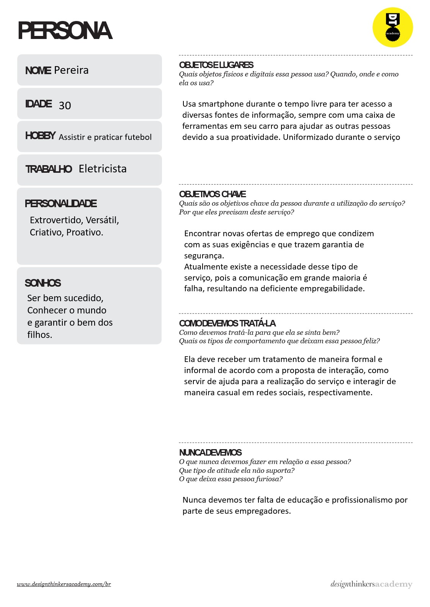
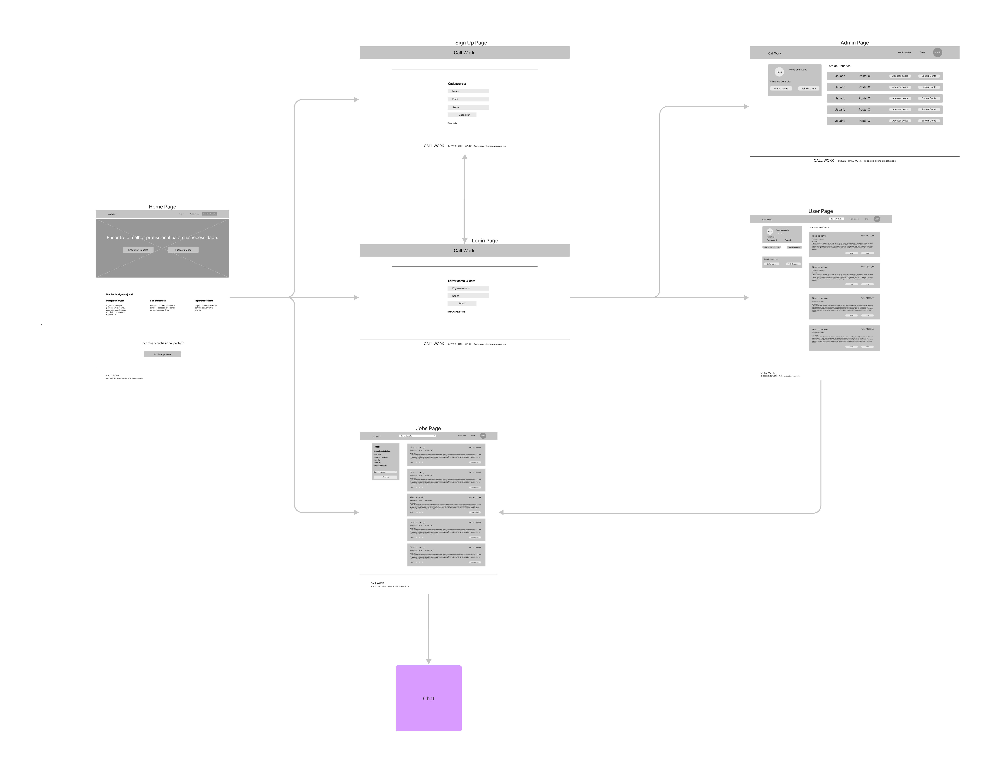
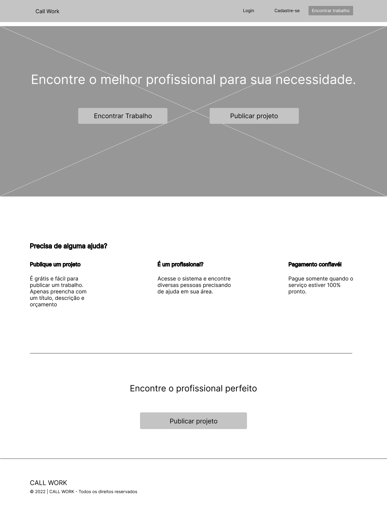
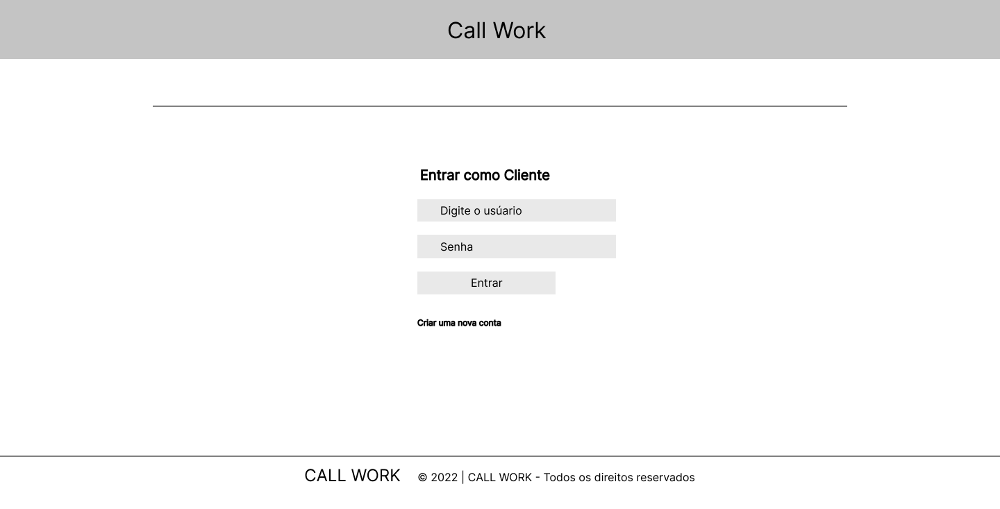
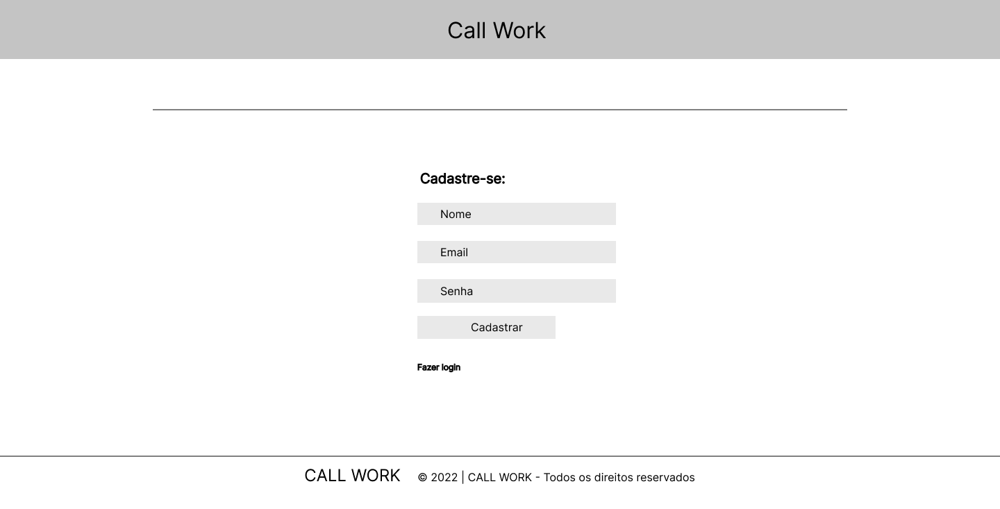
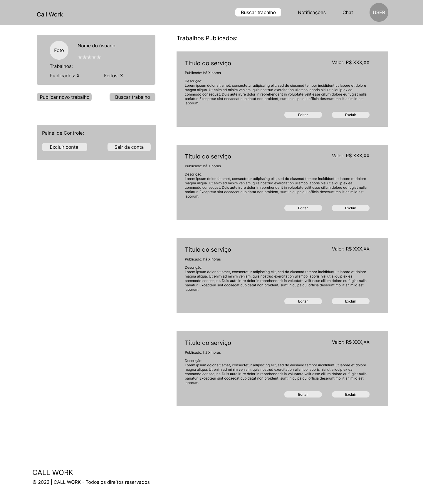
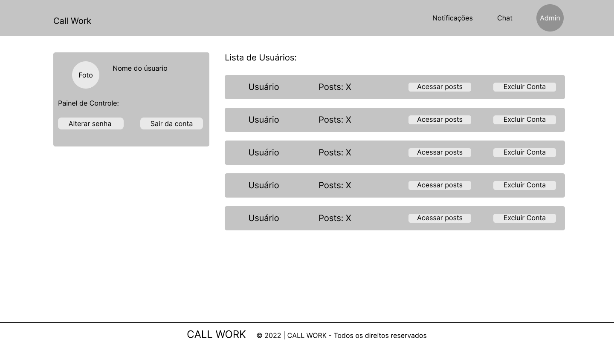
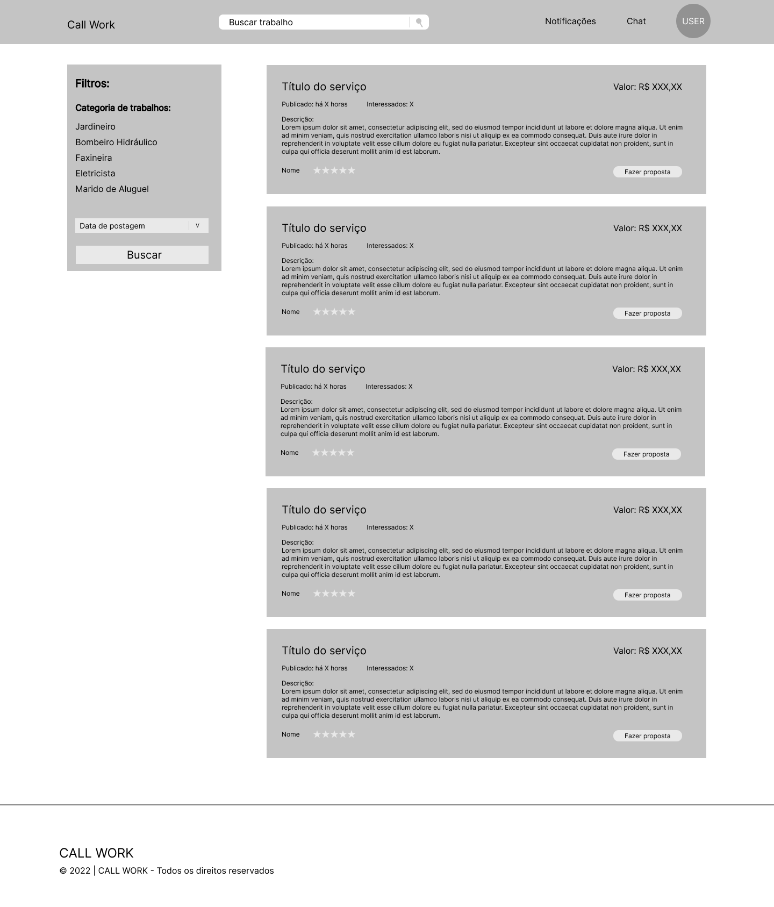

# Informações do Projeto
`TÍTULO DO PROJETO`  

Guia de Serviços - CALL WORK

`CURSO` teste

Sistemas de Informação - PUC Minas

## Participantes

* Arthur Henrique da Silva Proença
* Gustavo Henrique de Moura Luz
* Ítalo Braga Perdigão
* Matheus Henrique de Souza Oliveira
* Pâmella Almeida
* Vinicius Liberio Gomes de Lacerda

# Estrutura do Documento

- [Informações do Projeto](#informações-do-projeto)
  - [Participantes](#participantes)
- [Estrutura do Documento](#estrutura-do-documento)
- [Introdução](#introdução)
  - [Problema](#problema)
  - [Justificativa](#justificativa)
  - [Público-Alvo](#público-alvo)
- [Especificações do Projeto](#especificações-do-projeto)
  - [Personas e Mapas de Empatia](#personas-e-mapas-de-empatia)
  - [Histórias de Usuários](#histórias-de-usuários)
  - [Requisitos](#requisitos)
    - [Requisitos Funcionais](#requisitos-funcionais)
    - [Requisitos não Funcionais](#requisitos-não-funcionais)
  - [Restrições](#restrições)
- [Projeto de Interface](#projeto-de-interface)
  - [User Flow](#user-flow)
  - [Wireframes](#wireframes)
- [Metodologia](#metodologia)
  - [Divisão de Papéis](#divisão-de-papéis)
  - [Ferramentas](#ferramentas)
  - [Controle de Versão](#controle-de-versão)
- [Projeto da Solução](#projeto-da-solução)
  - [Tecnologias utilizadas](#tecnologias-utilizadas)
  - [Arquitetura da solução](#arquitetura-da-solução)
- [Avaliação da aplicação](#avaliação-da-aplicação)
    - [Plano de testes](#plano-de-testes)
    - [Registros de testes](#registro-de-testes)
- [Referências](#referências)

# Introdução

## Problema

Desde sempre, muitas pessoas necessitaram de outras para a realização de tarefas que não conseguiram concluir, muitas vezes por falta de tempo ou conhecimento. Com o passar do tempo as formas comuns de freelancers procurarem emprego estão se tornando obsoletas e as pessoas passaram a ter dificuldades em encontra-los.

## Justificativa

Com as dificuldades em encontrar um bom profissional ou até um bom serviço, nasceu o projeto CALL WORK que tem uma proposta de facilitar e conciliar
o contato entre o contratante e o profissional, funcionando como um
guia de serviços, no qual o site serve para encontrar e divulgar trabalhos.

## Público-Alvo

Inicialmente, as vagas, além dos contratantes, serão focadas para servidores autônomos de baixa
especialização, disponibilizando tarefas como: eletricista, diarista, encanador,
jardineiro, babá, entre outros. Com o intuito facilitar e conciliar
o contato entre o contratante e o profissional

 
# Especificações do Projeto

Aqui estão algumas técnicas como o desenvolvimento da persona, mapa de empatia,
requisitos funcionais e não funcionais, e restrições de projeto.

## Personas e Mapas de Empatia

De acordo com as entrevistas qualitativas, pôde-se gerar mapas de empatia que auxiliaram na criação da persona
de uma pessoa profissional que pode resolver qualquer problema que possa vier acontecer em suas atividades diárias.

## Histórias de Usuários

Com base na análise das personas foram identificadas as seguintes histórias de usuários:

|EU COMO... `PERSONA`| QUERO/PRECISO ... `FUNCIONALIDADE` |PARA ... `MOTIVO/VALOR`                 |
|--------------------|------------------------------------|----------------------------------------|
|Eu como pintor      | Gostaria de uma plataforma que me  | Para que eu consiga mais               |
|                    | ajudasse a encontrar mais          | oportunidades de trabalho              |
|                    | oportunidades.                     |                                        |
|--------------------|------------------------------------|----------------------------------------|
| Eu como Dona       | Gostaria de sites que me           | Para realizar tarefas pequenos         |
| de casa            | orientassem melhor                 | consertos domésticos.                  |
|                    | sobre onde encontrar bons          |                                        |
|                    | profissionais.                     |                                        |
|--------------------|------------------------------------|----------------------------------------|
|Eu como encanador   | Gostaria de ferramentas online     | Para que eu tivesse mais segurança.    |
|                    | que me auxiliassem com as          |                                        |
|                    | transações financeiras.            |                                        |
|--------------------|------------------------------------|----------------------------------------|
| Eu como            | Gostaria de poder contratar        | Para realizar algumas tarefas em casa  |
| trabalhador em     | pessoas de confiança e com         | e ter mais segurança para trabalhar.   |
| home office        | bons históricos para realizar      |                                        |
|--------------------|------------------------------------|----------------------------------------|

## Requisitos

As tabelas que se seguem apresentam os requisitos funcionais e não funcionais que detalham o escopo do projeto.

### Requisitos Funcionais

|ID    | Descrição do Requisito                     | Prioridade |
|------|-------------------------------------------------|-------|
|RF-001| Permitir que o usuário cadastre tarefas         | ALTA  | 
|RF-002| Realizar pagamentos                             | MÉDIA |
|RF-003| Agendar serviços                                | ALTA  |
|RF-004| Cancelar serviços                               | ALTA  |
|RF-005| Emitir histórico e avaliações de solicitantes   | BAIXA |
|RF-006| Realizar cadastro de solicitante                | ALTA  |
|RF-007| Recuperar senha de login                        | MÉDIA |
|RF-008| Realizar cadastro de colaborador                | ALTA  |
|RF-009| Emitir lista de EPI e instruções ao colaborador | BAIXA |
|RF-010| Iniciar e finalizar serviços                    | BAIXA |
|RF-011| Localizar colaboradores                         | MÉDIA |
|RF-012| Localizar solicitantes                          | MÉDIA |
|RF-013| Suporte ao usuário                              | ALTA  |

### Requisitos não Funcionais

|ID     | Descrição do Requisito                                                      |Prioridade |
|-------|--------------------------------------------------------------------------------|--------|
|RNF-001| O sistema deve ser responsivo para rodar em um dispositivos móvel              |  MÉDIA | 
|RNF-002| Deve processar requisições do usuário em no máximo 3s                          |  ALTA  |
|RNF-003| Cadastramento simplificado                                                     |  BAIXA |
|RNF-004| Usabilidade simplificada                                                       |  MÉDIA |
|RNF-005| Transitar dados de forma segura                                                |  ALTA  |
|RNF-006| Avaliações de usuários simplificada (através uma disposição de cinco estrelas) |  BAIXA |
|RNF-007| Design e layout intuitivo                                                      |  BAIXA |
|RNF-008| Contratação de apenas um colaborador por serviço                               |  MÉDIA |
|RNF-009| Os navegadores suportados serão: Chrome, Firefox, Safari e Microsoft Edge      |  BAIXA |

## Restrições

O projeto está restrito pelos itens apresentados na tabela a seguir.

|ID| Restrição                                                      |
|--|----------------------------------------------------------------|
|01| O projeto deverá ser entregue até o final do semestre          |
|02| Guia de serviços relacionados somente com atividade doméstica  |
|03| Somente atividades que não exigem alto nível de especialização |
|04| Será permitida a associação de apenas 1 colaborador por serviço|
|05| A interface do sistema deve ser web                            |

# Projeto de Interface

Aqui se inicia o conceito do desenvolvimento do sistema web, usando como base o 
fluxo de usúario, wireframes e o protótipo interativo. Todas as páginas foram
criadas pensando em nos requisitos necessários.

## User Flow

## Wireframes

# Metodologia

Passamos por quatro fases para o desenvolvimento do projeto CALL WORK, sendo elas:
Coleta, análise, entendimento e ideação.

A partir das entrevistas foi possível criar os mapas de empatia que deram origem a persona.
Com a matriz de alinhamneto e o mapa de stakeholders e a persona, conseguimos definir nossos objetivos
e problema a ser solucionado.
O brainwriting e o mapa conceitual foram importantes para desenvolvimento do nosso projeto. Por ele
gerenciamos nossa divisão de papéis e tarefas.

## Divisão de Papéis

Contexto do projeto (Arthur, Ítalo)
  Estudo dos atuais e futuros impactos que o produto gera no ramo ao qual
  pertence, assim como seu desempenho.

Especificação do Projeto (Pâmella, Matheus e Gustavo)
  Coleta de dados baseada nas necessidades dos usuários e definição de
  requisições do projeto.

Projeto de Interface (Vinicius)
  Escopo da interface, sendo referência do que será desenvolvido durante
  o projeto.

Metodologia (Em grupo)
  Descrição das etapas de desenvolvimento do projeto.

Slide (Ítalo, Arthur)
  Material de apoio para apresentação do contexto geral do projeto.

Artefatos do Design Thinking (Em grupo)
  Organização de ideias afim de auxiliar na tomada de decisões.

## Ferramentas

| Ambiente  | Plataforma              |Link de Acesso |
|-----------|-------------------------|---------------|
|Processo de Design Thinking  | --- |  -------------- | 
|Repositório de código | GitHub | https://github.com/PBE-TIAW-2022-1/tiaw-pbe-20221-ViniciusPuc | 
|Hospedagem do site | Heroku |  https://callwork.herokuapp.com/ | 
|Protótipo Interativo | Figma | https://www.figma.com/file/j2Evu8ivdok9xExPx9bstb/Prototipo?node-id=0%3A1| 

 As ferramentas empregadas no projeto são:
 
 - Editor de código: VS Code;
 - Ferramentas de comunicação: Whatsapp;
 - Ferramentas de diagramação: Figma;
 - Plataforma de hospedagem: Heroku.
 
 O Visual Studio Code foi escolhido por possuir uma integração com o
 sistema de versão e a familiaridade. As ferramentas de comunicação foram implementadas pela facilidade 
 do uso. Por fim, para criar
 diagramas utilizamos o Figma como ferramenta por atender muito bem todas as nossas necessidades.

## Controle de Versão

 A ferramenta de controle de versão utilizada foi o
 [Git](https://git-scm.com/), sendo o [Github](https://github.com)
 utilizado na hospedagem dos repositórios para nossa aplicação e documentação.

Por convenção, usamos os seguintes nomes de branchs: 
 - `master`: versão estável já testada do software
 - `testVersion`: versão em testes do software
 - `developer`: versão de desenvolvimento do software
 
Na questão dos issues, nosso projeto usa as seguintes etiquetas:
 - `bug`: uma funcionalidade encontra-se com problemas
 - `feature`: uma nova funcionalidade precisa ser introduzida

# Projeto da solução
   Com o intuito de propor uma ferramenta arrojada mas com simplicidade decidimos desenvolver uma aplicação que fosse capaz de simplificar as relações de prestação de serviço doméstico, de uma forma que fosse possível realizar orçamento, encontrar bons profissionais, fazer e receber avaliações, realizar transações financeiras e etc. 

## Tecnologias utilizadas
  Em nossa aplicação utilizamos a linguagem de programação JavaScript, a linguagem de marcação de hipertextos HTML e a linguagem de estilização CSS. Como plataforma de desenvolvimento usamos a IDE Visual Studio Code. No versionamento de códigos utilizamos o GIT e para armazenar as documentações o GITHUB. E para o armazenamento WEB foi utilizado o Local Storage. Para realizar as reuniões com todo a equipe utilizamos o discord. E além das supracitadas o Heroku e o Replit.
  
  Prototipos de telas:
  
  Página Inicial (é possível observar as principais informações).
  
  
  Tela de cadastro para a posterior publicação de serviços.
  
  
  Página de Serviços
  
  
  "Página Sobre nós"

  
## Arquitetura da solução

  
  
    Apartir do diagrama de arquitetura é possivel observar o fluxo de dados que ocorre em nossa aplicação, no momento em que o usuário entra no site e é carregado todo o código HTML e que chama o JavaScript para trazer a dinamicidade para site, e no registro de informações ou busca os dados são obtidos a partir do Json Server.
 
  
## Plano de testes
  Para nos auxiliar no processo de desenvolvimento final da nossa aplicação, afim de assegurar a qualidade do produto, utilizamos os testes de software. O nosso primeiro teste foi o de usabilidade, selecionamos algumas pessoas para interagir com nossas aplicações para perceber se ela cumpre os requisistos necessários. Além disso realizamos os testes de carga para observar como a aplicação reage com os recebimentos de dados.

## Registro de testes

  Ao iniciar os testes de usabilidade percebemos dificuldade dos usuários em realizarem o contato via WhatsApp uma vez que o número de telefone deve ser inserido com o ddd e sem espaços. Para reverter esta dificuldade iremos incluir uma orientação na página. Além disso, observamos alguns erro na hora de realizar os cadastros de oportunidades e dificuldades na pesquisa de profissionais. Em seguida destacamos o que poderia ser melhorado e atualizamos os códigos para sanar o problema.

# Referências

Contexto do Projeto:

O QUE É GLOBALIZAÇÃO DO PONTO DE VISTA DA GEOGRAFIA. Brasil Escola, 2017. Disponível em: https://meuartigo.brasilescola.uol.com.br/educacao/o-que-e-globalizacao-do-ponto-de-vista-da-geografia.htm. Acessado em: 24/03/2022.
Revolução Industrial e Sociedade de Consumo em Massa. Fundação Perseu Abramo, 2014. Disponível em: https://fpabramo.org.br/2014/04/08/revolucao-industrial-e-sociedade-de-consumo-em-massa/. Acessado em: 24/03/2022.
Aristoteles. Ebiografia, 2021. Disponível em: https://www.ebiografia.com/aristoteles/. Acessado em: 24/03/2022. 

Especificação do Projeto:

Histórias de usuários com exemplos e um template. Atlassian, 2019. Disponível em: https://www.atlassian.com/br/agile/project-management/user-stories. Acessado em: 28/03/2022. 
Santos, Larissa. Como escrever boas histórias de usuário (User Stories). Medium, 2017. Disponível em: https://medium.com/vertice/como-escrever-boas-users-stories-hist%C3%B3rias-de-usu%C3%A1rios-b29c75043fac. Acessado em: 28/03/2022.
O que são Requisitos Funcionais e Requisitos Não Funcionais. Codificar, 2021. Disponível em: https://codificar.com.br/requisitos-funcionais-nao-funcionais/. Acessado em: 28/03/2022.
O que são Requisitos Funcionais e Não Funcionais. Analise de requisitos, 2021. https://analisederequisitos.com.br/requisitos-funcionais-e-nao-funcionais/. Acessado em: 28/03/2022.

Projeto de interface:  

Workana LLC. Disponível em: https://www.workana.com/. Acessado em: 2022.
Freelancer. Disponível em: https://www.br.freelancer.com/. Acessado em: 2022. 
99Freelas. Disponível em: https://www.99freelas.com.br/. Acessado em: 2022.
GetNinjas. Disponível em: https://www.getninjas.com.br/. Acessado em: 2022.

Testes de software:
https://blog.onedaytesting.com.br/teste-de-software/
https://geekflare.com/javascript-unit-testing/
